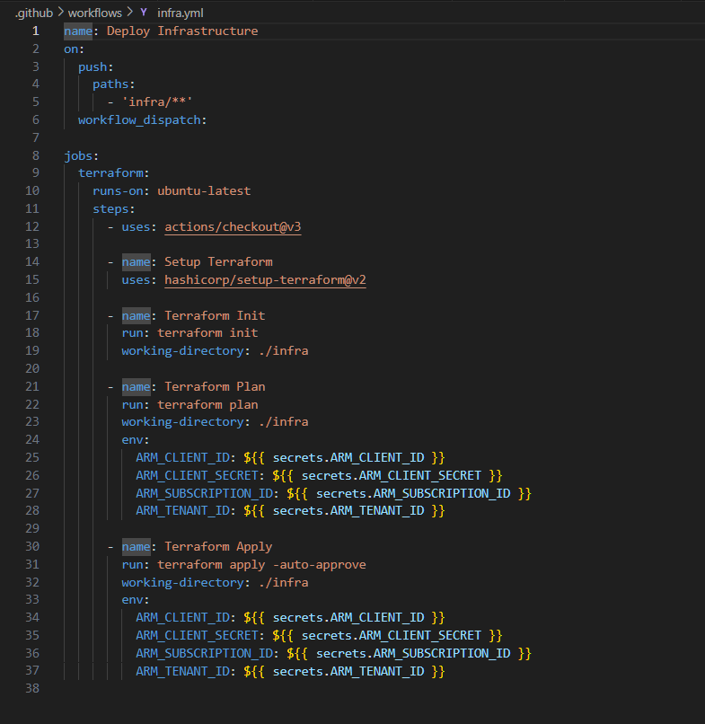
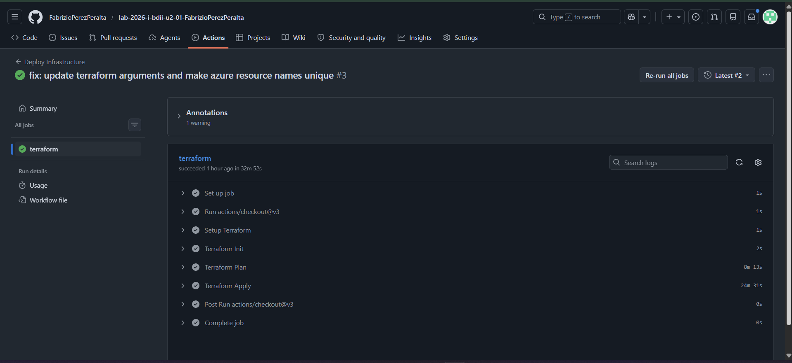
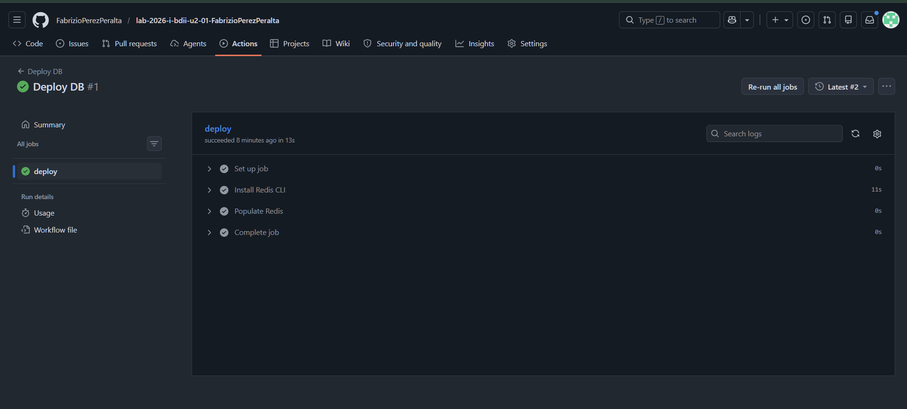
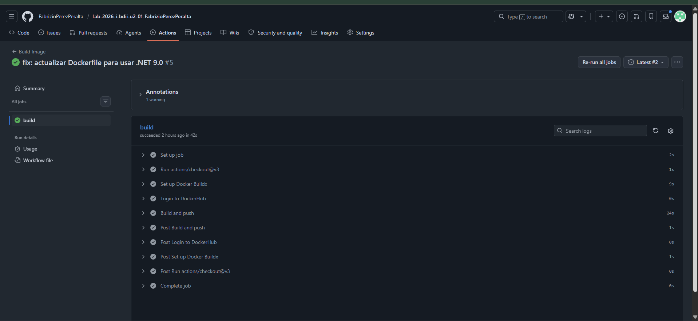
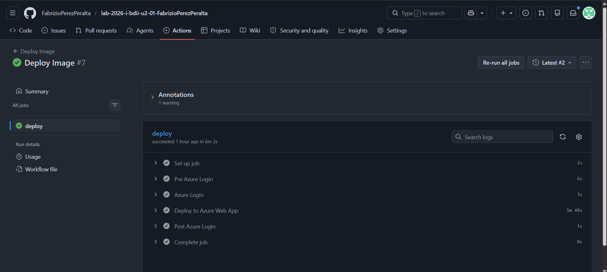

[](https://classroom.github.com/a/qK03qwmi)
[](https://classroom.github.com/open-in-codespaces?assignment_repo_id=24133970)
# SESION DE LABORATORIO N° 01: Creación de un API utilizando una base de datos Clave-Valor

### Nombre: Fabrizio Salvador Elias Perez Peralta
## OBJETIVOS
  * Comprender el funcionamiento de un motor de base de datos relacional a través de su instalaciónn y configuración.

## REQUERIMIENTOS
  * Conocimientos: 
    - Conocimientos básicos de gestión de base de datos en memoria
    - Conocimientos básicos de shell (linea de comandos).
  * Hardware:
    - Virtualization activada en el BIOS..
    - CPU SLAT-capable feature.
    - Al menos 4GB de RAM.
  * Software:
    - Windows 10 64bit: Pro, Enterprise o Education (1607 Anniversary Update, Build 14393 o Superior)
    - Docker Desktop
    - .Net 8 o superior
    - Powershell versión 7.x
    - DBeaver Community Edition

## CONSIDERACIONES INICIALES
  * Clonar el repositorio mediante git para tener los recursos necesaarios

## DESARROLLO

### PARTE I: Desplegando la base de datos

1. Iniciar la aplicación Docker Desktop:
2. Iniciar la aplicación Powershell o Windows Terminal en modo administrador 
3. Ejecutar el siguiente comando para crear una nueva instancia de la base de datos Redis
```
docker run --name redisdb -p 6379:6379 -d redis
```
4. Ejecutar el siguiente comando para iniciar sesión y conectarse al gestor de base de datos
```
docker exec -it redisdb redis-cli
```
5. Una vez dentro de interfaz de linea de comandos (CLI), ejecutar los siguientes comandos para establecer un objeto clave-valor y luego recuperarlo
```
set clave "upt2023"
get clave
```
6. Finalmente escribir "exit" para salir de interfaz de linea de comandos de Redis


### PARTE II: Construyendo el API

1. Iniciar la aplicación Powershell o Windows Terminal en modo administrador si es que no se tiene iniciada y ejecutar el siguiente comando
```
dotnet new webapi -o App.Redis.Api
```
2. Acceder a la carpeta recien creada y adicionar la libreria de Redis para Net.
```
cd .\App.Redis.Api\
dotnet add package Microsoft.Extensions.Caching.StackExchangeRedis
```
3. Iniciar Visual Studio Code tomando como base la carpeta generada (App.Redis.Api). Dentro de la carpeta Controllers generar un archivo TodosController.cs e introducir el siguiente código
```C#
using Microsoft.AspNetCore.Mvc;

namespace App.Redis.Api.Controllers
{
    [ApiController]
    [Route("[controller]")]
    public class TodosController : ControllerBase
    {
	List<string> todos = new List<string> { "shopping", "Watch Movie", "Gardening" };

        [HttpGet(Name = "All")]
        public async Task<IActionResult> GetAll()
        {
            List<string> myTodos = todos;
            bool IsCached = false;
            return Ok(new { IsCached, myTodos });
        }
    }
}
```
4. Abrir un terminal en Visual Studio Code (Ctrl+Ñ) o voler al terminal abierto, y ejecutar los siguientes comandos para compitar y ejecutar la aplicación. 
```
dotnet build
dotnet run
```
5. Despues de unos segundos se pintara en el terminal el acceso la url del API REST creado, por ejemplo http://localhost:5162/Todos (tener en cuenta que el puerto puede variear en su PC). Abrir un navegador de internet y colocar la URL anterior. El resultado a obtener deberia ser similar a:
```JSON
{"isCached":false,"myTodos":["shopping","Watch Movie","Gardening"]}
```
6. Volver a Visual Studio Code y en el archivo Program.cs agregar la siguiente linea después de `var builder = WebApplication.CreateBuilder(args)`:
```C#
builder.Services.AddStackExchangeRedisCache( options => options.Configuration = "localhost:6379" );
```
7. Modificar el archivo TodosController.cs con el siguiente código:
```C#
using System.Text.Json;
using Microsoft.AspNetCore.Mvc;
using Microsoft.Extensions.Caching.Distributed;

namespace App.Redis.Api.Controllers
{
    [ApiController]
    [Route("[controller]")]
    public class TodosController : ControllerBase
    {
	    List<string> todos = new List<string> { "shopping", "Watch Movie", "Gardening" };
        private readonly IDistributedCache _distributedCache;

        public TodosController(IDistributedCache distributedCache)
        {
            _distributedCache = distributedCache;
        }

        [HttpGet(Name = "All")]
        public async Task<IActionResult> GetAll()
        {
            List<string> myTodos = new List<string>();
            bool IsCached = false;
            string? cachedTodosString = string.Empty;
            cachedTodosString = await _distributedCache.GetStringAsync("_todos");
            if (!string.IsNullOrEmpty(cachedTodosString))
            {
                // loaded data from the redis cache.
                myTodos = JsonSerializer.Deserialize<List<string>>(cachedTodosString);
                IsCached = true;
            }
            else
            {
                // loading from code (in real-time from database)
                // then saving to the redis cache 
                myTodos = todos;
                IsCached = false;
                cachedTodosString = JsonSerializer.Serialize<List<string>>(todos);
                await _distributedCache.SetStringAsync("_todos", cachedTodosString);
            }
            return Ok(new { IsCached, myTodos });
        }
    }
}
```
8. Ejecutar el paso 4 (Parte II) para ejecutar la aplicación y luego verificar como indica el paso 5 (Parte II). Se deberia obtener dos resultados
```JSON
// Primer request
{"isCached":false,"myTodos":["shopping","Watch Movie","Gardening"]}
// Posteriores requests
{"isCached":true,"myTodos":["shopping","Watch Movie","Gardening"]}
```
9. Ejecutar el paso 4 (Parte I) para iniciar la CLI de Redis y escribir el siguiente comando.
```
keys *
```
10. Despues de esto la CLI deberia responder con el siguiente resultado.
```
1) "_todos"
```


### Parte III: Estableciendo expiración al cache de datos

1. En Visual Studio Code, en el archivo Program.cs reemplazar la linea `builder.Services.AddStackExchangeRedisCache( options => options.Configuration = "localhost:6379" );`
, por la siguiente instrucción, con esto se modificará el nombre del Store en Redis donde se estaban almacenando los datos:
```C#
builder.Services.AddStackExchangeRedisCache( options => { 
    options.Configuration = "localhost:6379"; options.InstanceName = "App.Redis.Api"; } );
```
2. Asimismo modificar el archivo TodosController.cs, a fin de establecer una expiración de 30 a 60 segundos.
```C#
using System.Text.Json;
using Microsoft.AspNetCore.Mvc;
using Microsoft.Extensions.Caching.Distributed;

namespace App.Redis.Api.Controllers
{
    [ApiController]
    [Route("[controller]")]
    public class TodosController : ControllerBase
    {
	    List<string> todos = new List<string> { "shopping", "Watch Movie", "Gardening" };
        private readonly IDistributedCache _distributedCache;

        public TodosController(IDistributedCache distributedCache)
        {
            _distributedCache = distributedCache;
        }

        [HttpGet(Name = "All")]
        public async Task<IActionResult> GetAll()
        {
            List<string> myTodos = new List<string>();
            bool IsCached = false;
            string? cachedTodosString = string.Empty;
            cachedTodosString = await _distributedCache.GetStringAsync("_todos");
            if (!string.IsNullOrEmpty(cachedTodosString))
            {
                // loaded data from the redis cache.
                myTodos = JsonSerializer.Deserialize<List<string>>(cachedTodosString);
                IsCached = true;
            }
            else
            {
                // loading from code (in real-time from database)
                // then saving to the redis cache 
                myTodos = todos;
                IsCached = false;
                cachedTodosString = JsonSerializer.Serialize<List<string>>(todos);
                var expiryOptions = new DistributedCacheEntryOptions()
                {
	                AbsoluteExpirationRelativeToNow = TimeSpan.FromSeconds(60),
	                SlidingExpiration = TimeSpan.FromSeconds(30)
                };
                await _distributedCache.SetStringAsync("_todos", cachedTodosString, expiryOptions);
            }
            return Ok(new { IsCached, myTodos });
        }
    }
}
```
3. Ejecutar los pasos del 8 al 10 (Parte II) para verificar los resultados.


### Parte IV: Eliminando el cache

1. En Visual Studio Code, adicionar un metodo a la clase TodosController, que permitica eliminar una clave
```C#
[HttpGet("clear-cache/{key}")]
public async Task<IActionResult> ClearCache(string key)
{
  await _distributedCache.RemoveAsync(key);
  return Ok(new { Message = $"cleared cache for key -{key}" });
}
```
2. En un navegador de internet ingresar la url http://localhost:XXXX/Todos (reemplazar XXXX puerto definido por .Net), actualizar para que se genere en la base de datos cache y luego introduzca la siguiente url http://localhost:XXXX/Todos/clear-cache/_todos. Verificar que se haya eliminado los datos correspondientes utilizando la primera URL.

---
## Actividades Encargadas
1. Genere el archivo Dockerfile para dockerizar el API creado.
   - **Completado.** El archivo `Dockerfile` ha sido creado en la raíz del proyecto.
   **Código de `Dockerfile`:**
   ```dockerfile
   FROM mcr.microsoft.com/dotnet/sdk:9.0 AS build
   WORKDIR /src
   COPY ["App.Redis.Api/App.Redis.Api.csproj", "App.Redis.Api/"]
   RUN dotnet restore "App.Redis.Api/App.Redis.Api.csproj"
   COPY . .
   WORKDIR "/src/App.Redis.Api"
   RUN dotnet build "App.Redis.Api.csproj" -c Release -o /app/build

   FROM build AS publish
   RUN dotnet publish "App.Redis.Api.csproj" -c Release -o /app/publish

   FROM mcr.microsoft.com/dotnet/aspnet:9.0 AS final
   WORKDIR /app
   EXPOSE 80
   COPY --from=publish /app/publish .
   ENTRYPOINT ["dotnet", "App.Redis.Api.dll"]
   ```
   

2. Genere el archivo main.tf dentro de la carpeta infra, para crear mediante Terraform la infrastructura, en Redis (https://redis.io/) y el backend en un servicio Azure AppService u otro servicio Saas que maneje contenedores
   - **Completado.** El archivo `main.tf` ha sido creado en la carpeta `infra/`.
   **Código de `infra/main.tf`:**
   ```hcl
   provider "azurerm" {
     features {}
   }

   resource "azurerm_resource_group" "rg" {
     name     = "redis-api-rg"
     location = "East US"
   }

   resource "azurerm_redis_cache" "redis" {
     name                = "redis-api-cache-fperez"
     location            = azurerm_resource_group.rg.location
     resource_group_name = azurerm_resource_group.rg.name
     capacity            = 0
     family              = "C"
     sku_name            = "Basic"
     non_ssl_port_enabled = false
     minimum_tls_version = "1.2"
   }

   resource "azurerm_service_plan" "plan" {
     name                = "redis-api-appserviceplan"
     location            = azurerm_resource_group.rg.location
     resource_group_name = azurerm_resource_group.rg.name
     os_type             = "Linux"
     sku_name            = "B1"
   }

   resource "azurerm_linux_web_app" "app" {
     name                = "redis-api-webapp-fperez"
     location            = azurerm_resource_group.rg.location
     resource_group_name = azurerm_resource_group.rg.name
     service_plan_id     = azurerm_service_plan.plan.id

     site_config {
       application_stack {
         docker_image_name     = "DOCKERHUB_USERNAME/redis-api:latest"
         docker_registry_url   = "https://index.docker.io/v1/"
       }
     }

     app_settings = {
       "REDIS_CONNECTION_STRING" = azurerm_redis_cache.redis.primary_connection_string
     }
   }
   ```
   

3. Genere la automatizacion infra.yml, que despliegue la infraestrutura.
   - **Completado.** El workflow `infra.yml` ha sido creado en `.github/workflows/`.
   **Código de `infra.yml`:**
   ```yaml
   name: Deploy Infrastructure
   on:
     push:
       paths:
         - 'infra/**'
     workflow_dispatch:

   jobs:
     terraform:
       runs-on: ubuntu-latest
       steps:
         - uses: actions/checkout@v3

         - name: Setup Terraform
           uses: hashicorp/setup-terraform@v2

         - name: Terraform Init
           run: terraform init
           working-directory: ./infra

         - name: Terraform Plan
           run: terraform plan
           working-directory: ./infra
           env:
             ARM_CLIENT_ID: ${{ secrets.ARM_CLIENT_ID }}
             ARM_CLIENT_SECRET: ${{ secrets.ARM_CLIENT_SECRET }}
             ARM_SUBSCRIPTION_ID: ${{ secrets.ARM_SUBSCRIPTION_ID }}
             ARM_TENANT_ID: ${{ secrets.ARM_TENANT_ID }}

         - name: Terraform Apply
           run: terraform apply -auto-approve
           working-directory: ./infra
           env:
             ARM_CLIENT_ID: ${{ secrets.ARM_CLIENT_ID }}
             ARM_CLIENT_SECRET: ${{ secrets.ARM_CLIENT_SECRET }}
             ARM_SUBSCRIPTION_ID: ${{ secrets.ARM_SUBSCRIPTION_ID }}
             ARM_TENANT_ID: ${{ secrets.ARM_TENANT_ID }}
   ```
   

4. Genere la automatización deploydb.yml, que permita cargar datos en su base de datos Redis.
   - **Completado.** El workflow `deploydb.yml` ha sido creado en `.github/workflows/`.
   **Código de `deploydb.yml`:**
   ```yaml
   name: Deploy DB
   on: [workflow_dispatch]

   jobs:
     deploy:
       runs-on: ubuntu-latest
       steps:
         - name: Install Redis CLI
           run: sudo apt-get update && sudo apt-get install -y redis-tools

         - name: Populate Redis
           run: |
             redis-cli -h ${{ secrets.REDIS_HOST }} -p 6380 -a ${{ secrets.REDIS_PASSWORD }} --tls set "init_key" "init_value"
   ```
   

5. Genere la automatizacion buildimage.yml para construir la imagen y publicarla como paquete en su repositorio.
   - **Completado.** El workflow `buildimage.yml` ha sido creado en `.github/workflows/`.
   **Código de `buildimage.yml`:**
   ```yaml
   name: Build Image
   on:
     push:
       branches: [ "main" ]

   jobs:
     build:
       runs-on: ubuntu-latest
       steps:
         - uses: actions/checkout@v3

         - name: Set up Docker Buildx
           uses: docker/setup-buildx-action@v2

         - name: Login to DockerHub
           uses: docker/login-action@v2
           with:
             username: ${{ secrets.DOCKERHUB_USERNAME }}
             password: ${{ secrets.DOCKERHUB_TOKEN }}

         - name: Build and push
           uses: docker/build-push-action@v4
           with:
             context: .
             push: true
             tags: ${{ secrets.DOCKERHUB_USERNAME }}/redis-api:latest
   ```
   

6. Genere la automatizacion deployimage.yml que despliege la imagen previamente publicada en el servicio Web que maneje contenedores.
   - **Completado.** El workflow `deployimage.yml` ha sido creado en `.github/workflows/`.
   **Código de `deployimage.yml`:**
   ```yaml
   name: Deploy Image
   on:
     workflow_run:
       workflows: ["Build Image"]
       types:
         - completed

   jobs:
     deploy:
       runs-on: ubuntu-latest
       steps:
         - name: Azure Login
           uses: azure/login@v1
           with:
             creds: ${{ secrets.AZURE_CREDENTIALS }}

         - name: Deploy to Azure Web App
           uses: azure/webapps-deploy@v2
           with:
             app-name: 'redis-api-webapp-fperez'
             images: '${{ secrets.DOCKERHUB_USERNAME }}/redis-api:latest'
   ```
   
